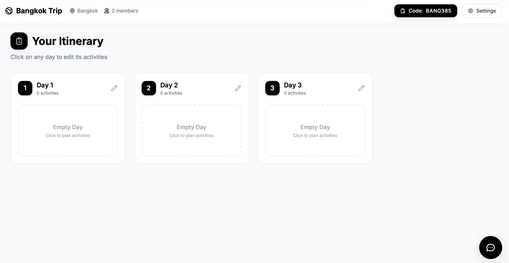
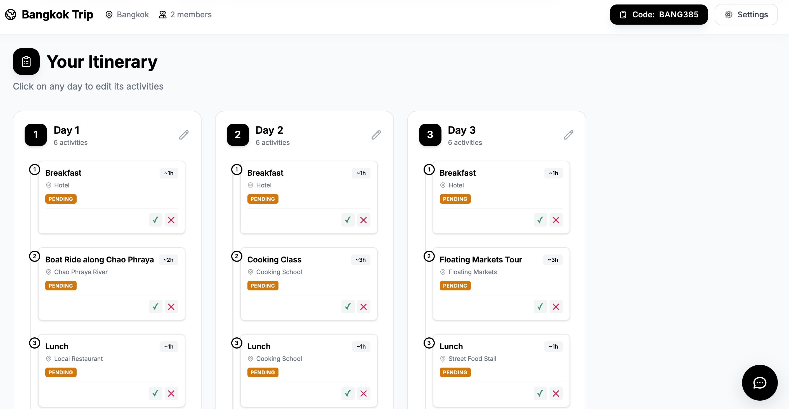
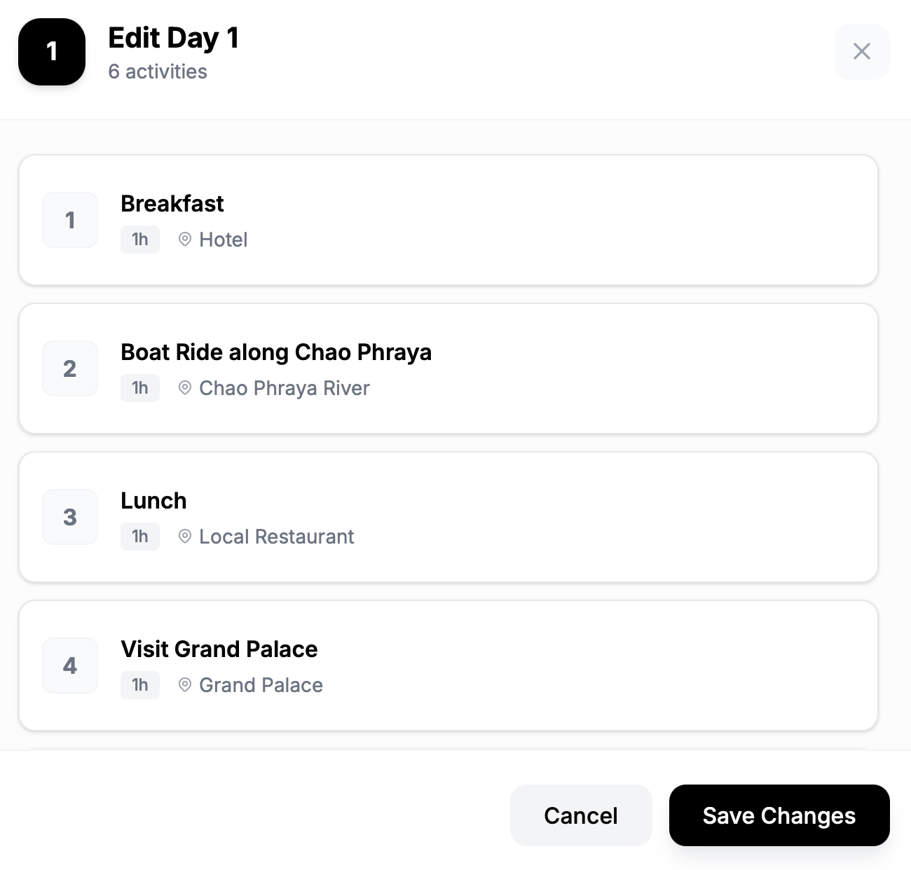
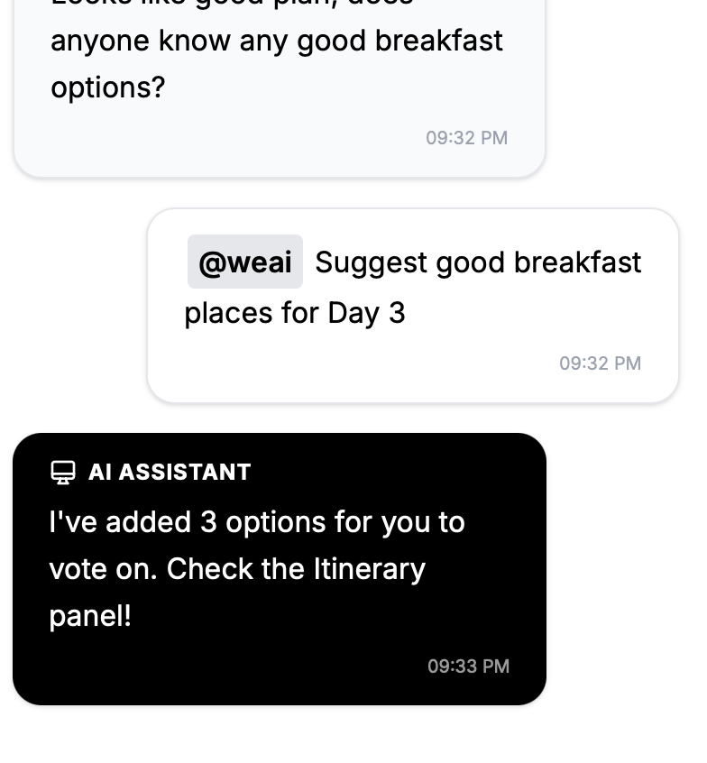

# WeGoAI

**AI-Powered Group Trip Planner with Real-Time Collaboration**

WeGoAI is a modern web application that helps groups plan trips together using AI-powered suggestions, real-time collaboration, and smart itinerary management. Built with Next.js 16, React 19, and a Python AI backend powered by CrewAI and NVIDIA NIM.

---

## Features

### AI-Powered Suggestions
- **Smart Recommendations** – Mention `@weai` in the chat to get personalized trip suggestions
- **CrewAI Agents** – Multi-agent system with Planner, Search, and Preference agents
- **Real-Time Search** – Integrated Google Serper API for up-to-date travel information
- **Travel Time Calculator** – OpenRouteService integration for accurate travel duration estimates

### Group Collaboration
- **Real-Time Group Chat** – Collaborate with your travel companions in real-time
- **Democratic Voting** – Vote on activities and destinations as a group
- **Invite System** – Share an invite code to add friends to your trip
- **User Preferences** – Track individual preferences to make balanced recommendations

### Location Services
- **Destination Autocomplete** – Smart city search with coordinates
- **Places API** – Search for cities, hotels, and airports
- **OpenRouteService Integration** – Travel time calculations between locations

---

## See It In Action

### Itinerary Dashboard
Create and manage your trip itinerary with a clean, day-by-day view.



### AI-Powered Planning
Ask the AI assistant to plan your entire trip with a simple message.


### Generated Itinerary
The AI automatically populates activities across all days with voting options.



### Day Editor
Edit individual days with detailed activity information and locations.



### Smart Suggestions
Get targeted suggestions for specific needs like breakfast spots.



---

## Getting Started

### Prerequisites

- **Node.js** 18+ with npm
- **Python** 3.9+
- **MongoDB** (local or Atlas instance)

### API Keys Required

Create a `.env` file in the project root with:

```env
# MongoDB Connection
MONGODB_URI=mongodb://localhost:27017/wegoai

# AI Backend (NVIDIA NIM)
NVIDIA_NIM_API_KEY=your_nvidia_nim_api_key

# Google Serper (for web search)
SERPER_API_KEY=your_serper_api_key

# OpenRouteService (for travel times)
ORS_API_KEY=your_openrouteservice_api_key
```

### Installation

1. **Clone the repository**
   ```bash
   git clone https://github.com/your-username/WeGoAI.git
   cd WeGoAI
   ```

2. **Install frontend dependencies**
   ```bash
   npm install
   ```

3. **Install backend dependencies**
   ```bash
   pip install -r backend/requirements.txt
   ```

### Running the Application

You need to run both the frontend and backend servers:

**Terminal 1 – Frontend (Next.js)**
```bash
npm run dev
```
Opens at [http://localhost:3000](http://localhost:3000)

**Terminal 2 – AI Backend (Python)**
```bash
npm run dev:ai
# or directly:
python3 backend/server.py
```
Runs at [http://127.0.0.1:5328](http://127.0.0.1:5328)

---

## Project Structure

```
WeGoAI/
├── src/
│   ├── app/
│   │   ├── page.tsx              # Home page (create/join trip)
│   │   ├── trip/[id]/            # Trip pages
│   │   │   ├── page.tsx          # Main trip view
│   │   │   └── join/page.tsx     # Join trip page
│   │   ├── api/                  # Next.js API routes
│   │   │   ├── ai/               # AI suggestion proxy
│   │   │   ├── trips/            # Trip CRUD operations
│   │   │   ├── itinerary/        # Itinerary management
│   │   │   ├── messages/         # Chat messages
│   │   │   ├── hotels/           # Hotel search
│   │   │   └── places/           # Location autocomplete
│   │   ├── layout.tsx            # Root layout
│   │   └── globals.css           # Global styles
│   ├── components/
│   │   ├── ChatInterface.tsx     # Real-time chat component
│   │   ├── DayEditor.tsx         # Day activity editor
│   │   ├── DaySections.tsx       # Day sections component
│   │   └── FloatingChat.tsx      # Floating chat overlay
│   └── lib/
│       └── db/
│           └── connection.ts     # MongoDB connection
├── backend/
│   ├── server.py                 # AI backend HTTP server
│   ├── requirements.txt          # Python dependencies
│   └── ai/
│       ├── crew.py               # CrewAI agents & tasks
│       └── handlers.py           # Request handlers
├── public/                       # Static assets
├── package.json
└── README.md
```

---

## Tech Stack

### Frontend
| Technology | Purpose |
|------------|---------|
| **Next.js 16** | React framework with App Router |
| **React 19** | UI library with latest features |
| **TypeScript** | Type-safe development |
| **Tailwind CSS 4** | Utility-first styling |
| **Socket.IO Client** | Real-time communication |

### Backend
| Technology | Purpose |
|------------|---------|
| **Python 3.9+** | AI backend runtime |
| **CrewAI** | Multi-agent AI orchestration |
| **LangChain** | LLM integration framework |
| **NVIDIA NIM** | Llama 3.1 8B model hosting |
| **MongoDB/Mongoose** | Database for trips, users, messages |

### External APIs
| API | Purpose |
|-----|---------|
| **Google Serper** | Web search for travel info |
| **OpenRouteService** | Travel time calculations |
| **Nominatim** | Location autocomplete |

---

## How It Works

### 1. Create or Join a Trip
- Create a new trip by specifying destination, group size, and duration
- Share the 8-character invite code with friends to join

### 2. Chat with AI
- In the trip chat, mention `@weai` followed by your request
- Example: `@weai find the best restaurants near the Eiffel Tower`

### 3. Build Your Itinerary
- AI suggests activities based on your preferences and context
- Add, remove, or reorder activities in the itinerary panel
- Vote on activities with your group

### 4. Automatic Optimization
- Travel times are automatically calculated between activities
- Clash detection warns about scheduling conflicts
- Group preferences are balanced in recommendations

---

## API Endpoints

### Frontend API Routes (Next.js)

| Endpoint | Method | Description |
|----------|--------|-------------|
| `/api/trips` | GET/POST | List/Create trips |
| `/api/trips/[id]` | GET/PUT/DELETE | Single trip operations |
| `/api/itinerary/[tripId]` | GET/POST/PUT | Itinerary management |
| `/api/messages/[tripId]` | GET/POST | Chat messages |
| `/api/places` | GET | Location autocomplete |
| `/api/hotels` | GET | Hotel search |

### AI Backend

| Endpoint | Method | Description |
|----------|--------|-------------|
| `/api/ai/suggest` | POST | Get AI suggestions |

**Request Body:**
```json
{
  "query": "find good restaurants",
  "tripContext": { "destination": "Paris", "groupSize": 4 },
  "chatHistory": [],
  "action": "suggest"
}
```

---

## Deployment

### Vercel (Frontend)
The frontend is configured for Vercel deployment:
```bash
vercel deploy
```

### AI Backend
The Python backend can be deployed to:
- **Railway** – Easy Python hosting
- **Render** – Free tier available
- **AWS Lambda** – Serverless option
- **Docker** – Self-hosted

---

## Contributing

1. Fork the repository
2. Create a feature branch (`git checkout -b feature/amazing-feature`)
3. Commit your changes (`git commit -m 'Add amazing feature'`)
4. Push to the branch (`git push origin feature/amazing-feature`)
5. Open a Pull Request

---

## License

This project is licensed under the MIT License – see the [LICENSE](LICENSE) file for details.

---

## Acknowledgments

- [CrewAI](https://github.com/joaomdmoura/crewAI) – Multi-agent orchestration
- [NVIDIA NIM](https://developer.nvidia.com/nim) – LLM inference
- [Next.js](https://nextjs.org) – React framework
- [OpenRouteService](https://openrouteservice.org) – Routing API
- [Google Serper](https://serper.dev) – Web search API
